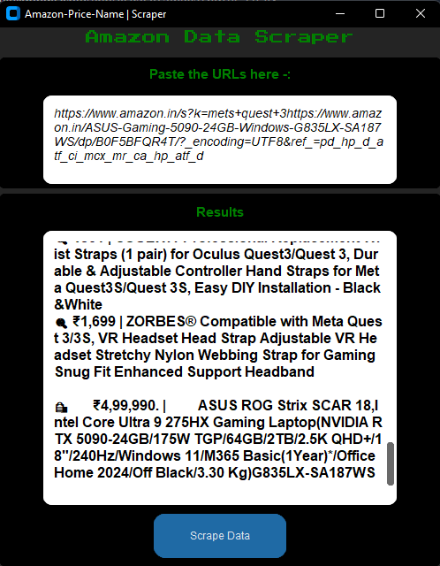

# Amazon Data Scraper

A fast and simple desktop application to scrape product names and prices from Amazon pages.

Built using Python, Playwright, BeautifulSoup, and CustomTkinter.

---

## 🚀 Features

- Scrapes **product name + price** instantly
- Supports:
  - Single product pages
  - Search result pages (multiple products)
- Paste **multiple URLs at once**
- Live results displayed inside GUI
- Export data directly to CSV
- Smooth UI (threaded, no freezing)

---

## 🧠 How It Works

### 🔹 1. URL Input
- User pastes one or multiple Amazon URLs
- URLs are extracted using regex

---

### 🔹 2. Smart Page Detection

The app automatically detects page type:

- `/dp/` or `/gp/` → Single Product Page  
- `/s?` or `/search` → Search Results Page  

---

### 🔹 3. Data Extraction

Using BeautifulSoup:

- Product Name → extracted from title elements  
- Product Price → extracted from price spans  

For search pages:
- Extracts multiple products in one go

---

### 🔹 4. Live Scraping Engine

- Uses Playwright (Chromium)
- Runs in headless mode
- Adds delay to avoid blocking
- Mimics real user behavior

---

### 🔹 5. Results Display

- Shows structured output inside GUI
- Updates in real-time while scraping

Output format:
    -🛍️ ₹Price | Product Name  
    -🔍 ₹Price | Product Name

---

### 🔹 6. CSV Export

- User selects save location
- Data saved as:
    Product Name | Product Price

---

### 🔹 7. Multithreading

- Scraping runs in background
- GUI stays responsive

---

## 🖥️ Screenshots

---

## 📦 What You Get

- Ready-to-use `.exe` application
- No Python installation required
- Clean and minimal interface

---

## ⚠️ Note

Amazon may update its HTML structure.  
Selectors might need updates if scraping stops working.

---

## 🛠️ Tech Stack

- Python
- Playwright
- BeautifulSoup
- CustomTkinter
- CSV

---

## 💼 Use Cases

- Product data collection  
- Market research  
- Price monitoring  
- E-commerce automation  

---

## 👨‍💻 Author

Ved Vatsal  
Python Developer | Automation & Web Scraping Specialist
